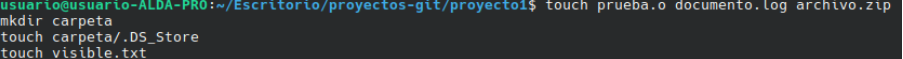
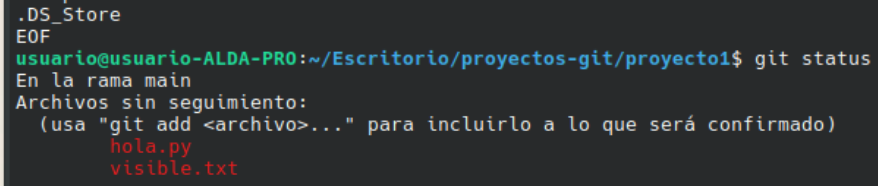
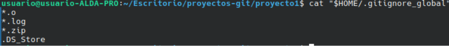
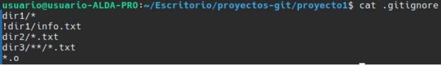
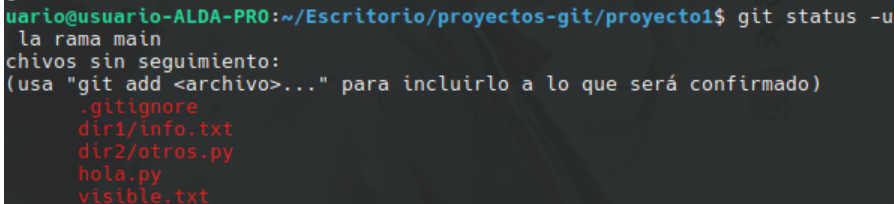
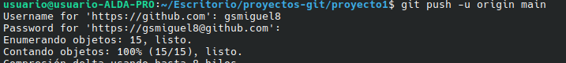

# Experimento con .gitignore

## Qué es .gitignore
Es un archivo donde le digo a Git qué archivos debe ignorar, es decir, que no aparezcan en `git status` ni se suban al repositorio.

## Parte 1: .gitignore global
Comprobé la configuración con:

    git config --get core.excludesfile

Salió `/home/usuario/.gitignore_global`. El archivo no existía, así que lo creé con estas reglas:

    *.o
    *.log
    *.zip
    .DS_Store

Despues creé `prueba.o`, `documento.log`, `archivo.zip` y `carpeta/.DS_Store`. Al hacer `git status` no aparecieron, porque el global los ignora.

## Parte 2: .gitignore local
Creé un archivo `.gitignore` en la carpeta del proyecto con estas reglas:

    dir1/*
    !dir1/info.txt
    dir2/*.txt
    dir3/**/*.txt
    *.o

    
Lo que hace cada regla:

| Regla | Qué hace | Resultado |
|---|---|---|
| `dir1/*` | Ignora todo lo que hay en dir1 | Funcionó |
| `!dir1/info.txt` | Excepción: info.txt NO se ignora | Funcionó, sí aparece |
| `dir2/*.txt` | Ignora los .txt de dir2 | `test.txt` ignorado, `otros.py` aparece |
| `dir3/**/*.txt` | Ignora los .txt de dir3 y sus subcarpetas | Funcionó |
| `*.o` | Ignora los .o en cualquier carpeta | Funcionó |

## El símbolo !
El `!` significa "excepción": aunque una regla anterior ignore el archivo, este sí se quiere. Tiene que ir después de la regla que ignora.

Después hice `git add dir1/info.txt` y el archivo apareció listo para confirmar.

## Diferencia entre global y local

| | Global | Local |
|---|---|---|
| Dónde está | En mi carpeta personal (`~/.gitignore_global`) | Dentro del proyecto (`.gitignore`) |
| A qué repos afecta | A todos los de mi ordenador | Solo a ese proyecto |
| Se sube con push | No | Sí |
| Lo ven otras personas | No | Sí |
| Para qué sirve | Archivos de mi sistema o editor | Reglas propias del proyecto |

## Push

